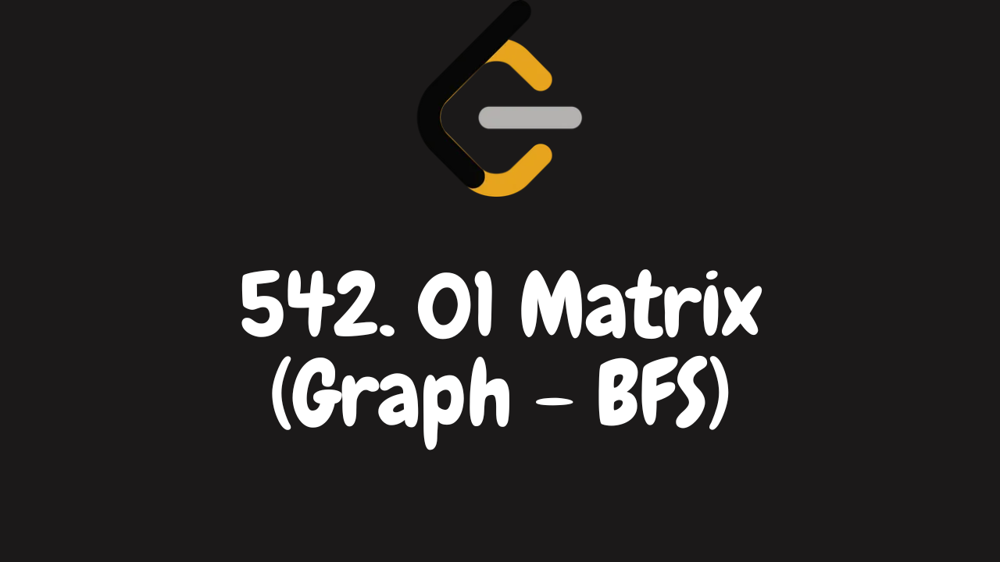

<h2><a href="https://leetcode.com/problems/01-matrix">542. 01 Matrix</a></h2><h3>Medium</h3><hr><p>Given an <code>m x n</code> binary matrix <code>mat</code>, return <em>the distance of the nearest </em><code>0</code><em> for each cell</em>.</p>

<p>The distance between two adjacent cells is <code>1</code>.</p>

<p>&nbsp;</p>
<p><strong class="example">Example 1:</strong></p>

<pre>
<strong>Input:</strong> mat = [[0,0,0],[0,1,0],[0,0,0]]
<strong>Output:</strong> [[0,0,0],[0,1,0],[0,0,0]]
</pre>

<p><strong class="example">Example 2:</strong></p>

<pre>
<strong>Input:</strong> mat = [[0,0,0],[0,1,0],[1,1,1]]
<strong>Output:</strong> [[0,0,0],[0,1,0],[1,2,1]]
</pre>

<p>&nbsp;</p>
<p><strong>Constraints:</strong></p>

<ul>
	<li><code>m == mat.length</code></li>
	<li><code>n == mat[i].length</code></li>
	<li><code>1 &lt;= m, n &lt;= 10<sup>4</sup></code></li>
	<li><code>1 &lt;= m * n &lt;= 10<sup>4</sup></code></li>
	<li><code>mat[i][j]</code> is either <code>0</code> or <code>1</code>.</li>
	<li>There is at least one <code>0</code> in <code>mat</code>.</li>
</ul>

---

## 문제 풀이 및 접근

이 문제에서 구하고자 하는 것은 각 cell이 0부터 떨어진 거리 중 가장 가까운 거리를 in-place로 갱신한다.

어떤 특정 좌표에서 특정 좌표 까지의 이동시 가중치가 없고(= 가중치의 변화가 없는), 최소거리를 구하기 위해선 BFS 알고리즘을 사용할 수 있다.
BFS를 사용하면 모든 좌표를 탐색할 수 있으며, 거리 계산 시 이전 방문한 지점의 거리를 바탕으로 계산할 수 있다. 그리고 이것은 곧 최소 거리를 보장해준다.

BFS에서의 queue 에 담아 둘 시작 지점들을 고민해야 하는데, 이미 0 인 cell 은 거리를 갱신할 필요가 없으므로 0을 첫 출발점으로 정하여 q에 담는다.

이 좌표들의 거리는 최솟값이 0이 되고,
결국 최소값이 0인 좌표들 부터 탐색하여 거리를 +1씩 확장해 나간다.
이 때 중요한 점은, 방문한 지점을 다른 좌표에서 다시 방문하게 되면 거리가 최솟값이 보장 되지 않는다. 그래서 방문처리를 꼭 해줘야 한다.

bfs에서 사용하는 자료구조인 queue를 deque로 사용하여 좌표들을 꺼낼 때 O(N) 에서 O(1) 으로 최적화 할 수 있다.

```python
from collections import deque
class Solution:
    def updateMatrix(self, mat: List[List[int]]) -> List[List[int]]:
        rows, cols = len(mat), len(mat[0])
        q = deque()
        distances = [[float('inf')] * cols for _ in range(rows)]

        directions = [(-1, 0), (0, 1), (1, 0), (0, -1)]

        for i in range(rows):
            for j in range(cols):
                # 값이 0이면, 거리도 0 이므로 출발지점으로 q에 넣어준다.
                if mat[i][j] == 0:
                    q.append((i, j))
                    distances[i][j] = 0

        while q:
            x, y = q.popleft()
            for dx, dy in directions:
                nx, ny = x + dx, y + dy
                # matrix범위와 방문안한 경우 체크
                if 0 <= nx < rows and 0 <= ny < cols and distances[nx][ny] == float('inf'):
                    distances[nx][ny] = distances[x][y] + 1
                    q.append((nx, ny))

        return distances


```
